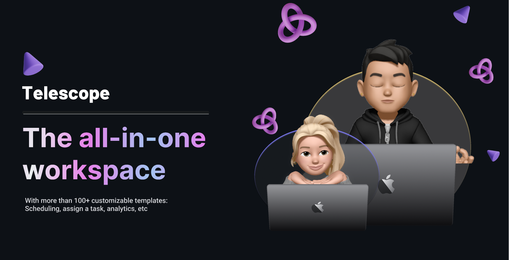

 <!--  -->

<!-- <h1 align="center"><a href="https://aayushbharti.in/" target="_blank"></a></h1> -->

  <a href="#">
    
  </a>

<br/>


<!-- [](https://aayushbharti.in)
<a href="https://x.com/iAayushBharti" target="_blank"></img></a>
<a href="https://linkedin.com/in/iAayushBharti" target="_blank"></a>
<a href="https://github.com/BabyDragon812" target="_blank"></a>

<a href="https://aayushbharti.in/" target="_blank"></a> -->
<h3>A Full Stack & Blockchain Engineer</h3>

- 🔭 I'm currently working on [Advancing my Skills with Languages and tools]()

- 🌱 I'm currently learning **Full Stack Development**

- 👨‍💻 I'm looking to collaborate on Fullt Stack & Blockchain projects

<!-- - 📝 I regularly write articles on [aayushbharti.in/blog](https://aayushbharti.in/blog) -->

- 💬 Ask me about **JavaScript, React, Frameworks, Web Development, Python, node.js, Java, etc ...**

<!-- - 📫 How to reach me **<hello@aayushbharti.in>** -->

<br/>

 &ensp; <b> Things I code with</b>
<br>

<p align="left">
<!--  -->

[]()

  <!-- jest -->
</p>
📊<b> Weekly development breakdown</b>

```txt
Total Time: 44 hrs 30 mins

TypeScript   15 hrs 1 min    ⣿⣿⣿⣿⣿⣿⣿⣿⣿⣿⣶⣀⣀⣀⣀⣀⣀⣀⣀⣀⣀⣀⣀⣀⣀   33.70 %
Python       10 hrs 20 mins  ⣿⣿⣿⣿⣿⣿⣿⣿⣀⣀⣀⣀⣀⣀⣀⣀⣀⣀⣀⣀⣀⣀⣀⣀⣀   22.72 %
JSON         5  hrs 5 mins   ⣿⣿⣿⣿⣀⣀⣀⣀⣀⣀⣀⣀⣀⣀⣀⣀⣀⣀⣀⣀⣀⣀⣀⣀⣀   11.36 %
JavaScript   8  hrs 8 mins   ⣿⣿⣿⣿⣿⣿⣀⣀⣀⣀⣀⣀⣀⣀⣀⣀⣀⣀⣀⣀⣀⣀⣀⣀⣀   18.18 %
Java         5  hrs 7 mins   ⣿⣿⣿⣿⣀⣀⣀⣀⣀⣀⣀⣀⣀⣀⣀⣀⣀⣀⣀⣀⣀⣀⣀⣀⣀   11.36 % 
Other        28 mins         ⣤⣀⣀⣀⣀⣀⣀⣀⣀⣀⣀⣀⣀⣀⣀⣀⣀⣀⣀⣀⣀⣀⣀⣀⣀   01.06 %
CSS          21 mins         ⣄⣀⣀⣀⣀⣀⣀⣀⣀⣀⣀⣀⣀⣀⣀⣀⣀⣀⣀⣀⣀⣀⣀⣀⣀   00.79 %
```


## 🚀 Languages and Tools

### 👉 Front-end

<p>


</p>

### 👉 Back-end

<p>


</p>

### 👉 Programming Language

<p>


</p>

### 👉 Database

<p>


</p>

### 👉 Unit Testing

<p>


</p>

### 👉 Version Control

<p>


</p>
<!--
### 👉 Others
<!--
<p>


</p>
 -->

<!--  <h3>Things I code with</h3>  -->
<!-- <p>

  
<!--     -->
<!--    -->
 <!-- 
<!--    -->
<!--    -->
<!--    -->
<!--    -->
<!--    -->
<!--    -->
<!--    -->
<!--    -->
<!--    -->
<!--    -->
 <!-- 
<!--    -->
<!--    -->
 <!-- 
  
<!--    -->
<!--    -->
<!--    -->
<!--  
  
  
</p> -->

<!--        <p></p>
<p>&nbsp;</p>

<p>&nbsp;</p>            -->
<!-- <b> Let's Connect..!</b>


<br/>

 &ensp;<b> Stats </b>


<div align=center>
  
  
  
</div>


<br/>

<!-- <p align="center">Made with ❤️ in India</p> -->

  <!-- <div align="center">
      
  <a href="https://github.com/aayushbharti/aayushbharti">
  </a>
  </div> -->
